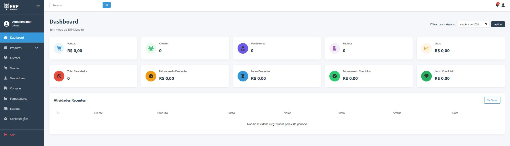
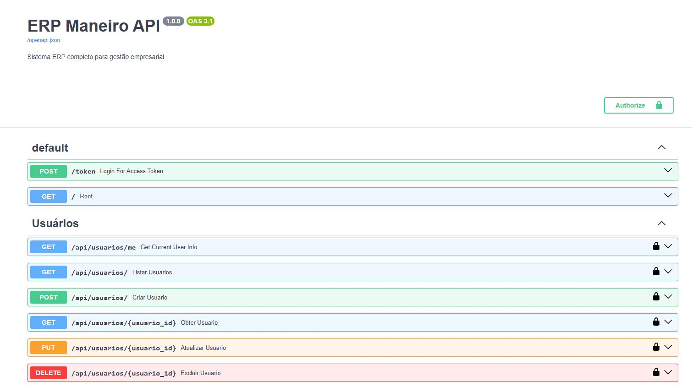

# ERP manero

<div align="center">
  
</div>
<div align="center">
  
</div>

## 📋 Sobre o Projeto

O **ERP manero** é um sistema de gestão empresarial completo e moderno, desenvolvido para atender às necessidades de pequenas e médias empresas. O projeto está em **fase inicial de desenvolvimento** e será expandido com diversos módulos no futuro.

### 🚀 Status do Projeto
- ✅ **Fase Inicial** - Sistema base funcional
- 🔄 **Em Desenvolvimento** - Novos módulos sendo implementados
- 📈 **Roadmap** - Expansão contínua de funcionalidades

### 🎯 Módulos Futuros Planejados
- **Permissões de Usuário** - Sistema avançado de controle de acesso
- **Módulo Contábil** - Gestão contábil completa
- **Contas a Receber (CR)** - Gestão de recebimentos
- **Contas a Pagar (AP)** - Gestão de pagamentos
- **Relatórios Avançados** - Business Intelligence
- **Integração Fiscal** - NFe, NFCe, SPED
- **Mobile App** - Aplicativo móvel
- **API Pública** - Integração com sistemas terceiros



## 🏗️ Arquitetura do Sistema

O ERP manero é construído com uma arquitetura moderna e escalável:

### Backend (API REST)
- **FastAPI** - Framework Python de alta performance
- **MySQL** - Banco de dados relacional
- **JWT** - Autenticação segura
- **Bcrypt** - Criptografia de senhas
- **Uvicorn** - Servidor ASGI

### Frontend (SPA)
- **HTML5/CSS3/JavaScript** - Interface moderna e responsiva
- **Chart.js** - Gráficos e dashboards interativos
- **Font Awesome** - Ícones profissionais
- **Design Responsivo** - Compatível com dispositivos móveis

## 📊 Módulos Implementados

### 🏠 Dashboard
- **Visão Geral** - Métricas principais do negócio
- **Gráficos Interativos** - Vendas, lucros e tendências
- **Indicadores KPI** - Total de vendas, clientes, pedidos
- **Filtros por Período** - Análise mensal/anual
- **Produtos Mais Vendidos** - Ranking de produtos
- **Vendas Recentes** - Últimas transações

### 👥 Gestão de Clientes
- **Cadastro Completo** - Pessoa Física e Jurídica
- **Dados de Contato** - Email, telefone, endereço
- **Histórico de Compras** - Relacionamento comercial
- **Status Ativo/Inativo** - Controle de clientes
- **Busca e Filtros** - Localização rápida

### 📦 Gestão de Produtos
- **Cadastro de Produtos** - Código, nome, descrição
- **Controle de Preços** - Custo e venda
- **Gestão de Estoque** - Quantidade atual e mínima
- **Categorização** - Organização por categorias
- **Movimentação** - Entrada, saída e ajustes
- **Alertas de Estoque** - Produtos em falta

### 🛒 Vendas e Pedidos
- **Pedidos de Venda** - Criação e gestão completa
- **Múltiplos Itens** - Produtos diversos por pedido
- **Cálculo Automático** - Subtotais, descontos, frete
- **Status de Pedidos** - Pendente, finalizada, cancelada
- **Formas de Pagamento** - Dinheiro, cartão, PIX, boleto
- **Comissões** - Cálculo para vendedores

### 🚚 Gestão de Compras
- **Pedidos de Compra** - Solicitações para fornecedores
- **Controle de Fornecedores** - Cadastro de parceiros
- **Aprovação de Pedidos** - Workflow de aprovação
- **Recebimento** - Controle de entregas
- **Integração com Estoque** - Atualização automática

### 👔 Vendedores
- **Cadastro de Vendedores** - Dados pessoais e profissionais
- **Comissões** - Percentual configurável
- **Relatórios de Vendas** - Performance individual
- **Metas e Objetivos** - Acompanhamento de resultados

### 💰 Financeiro
- **Contas Bancárias** - Múltiplas contas
- **Movimentação de Caixa** - Entradas e saídas
- **Contas a Pagar** - Gestão de fornecedores
- **Contas a Receber** - Gestão de clientes
- **Fluxo de Caixa** - Projeções financeiras

### 📋 Propostas Comerciais
- **Criação de Propostas** - Orçamentos detalhados
- **Validade** - Controle de prazo
- **Status** - Aberta, aprovada, recusada, vencida
- **Conversão em Pedidos** - Workflow comercial

### 📮 Gestão de Postagens
- **Códigos de Rastreio** - Acompanhamento de entregas
- **Transportadoras** - Múltiplas opções
- **Status de Entrega** - Postado, em trânsito, entregue
- **Histórico** - Rastreamento completo

### 📊 Relatórios
- **Relatórios de Vendas** - Análises detalhadas
- **Relatórios Financeiros** - Demonstrativos
- **Relatórios de Estoque** - Movimentações
- **Exportação** - Excel, PDF
- **Filtros Avançados** - Período, categoria, vendedor

### ⚙️ Configurações
- **Configurações do Sistema** - Parâmetros gerais
- **Configuração de API** - URLs e portas
- **Timeout de Usuários** - Segurança de sessão
- **Ambiente** - Desenvolvimento/Produção

## 🔐 Sistema de Autenticação

### Níveis de Acesso
- **Admin** - Acesso total ao sistema
- **Vendedor** - Módulos de vendas e clientes
- **Comprador** - Módulos de compras e estoque
- **Financeiro** - Módulos financeiros e relatórios

### Segurança
- **JWT Tokens** - Autenticação segura
- **Bcrypt** - Criptografia de senhas
- **Timeout Automático** - Sessões com tempo limite
- **Controle de Acesso** - Permissões por módulo

## 🛠️ Requisitos do Sistema

### Dependências Python
```
fastapi==0.104.1
uvicorn==0.23.2
python-dotenv==1.0.0
mysql-connector-python==8.1.0
python-multipart==0.0.6
python-jose[cryptography]==3.3.0
passlib[bcrypt]==1.7.4
pydantic==2.4.2
openpyxl==3.1.2
xlsxwriter==3.1.2
pandas==2.1.1
```

### Requisitos de Sistema
- **Python 3.8+**
- **MySQL 8.0+**
- **Navegador Web Moderno** (Chrome, Firefox, Edge)
- **4GB RAM** (mínimo)
- **2GB Espaço em Disco**

## 🚀 Como Executar o Projeto

### 1. Configuração Inicial
```bash
# Clone o repositório
git clone https://github.com/seu-usuario/ERP-manero.git
cd ERP-manero

# Instale as dependências
pip install -r requirements.txt
```

### 2. Configuração do Banco de Dados
```bash
# Execute o script de inicialização do banco
python init_db.py
```

### 3. Executar o Sistema
```bash
# Execute o arquivo de inicialização
start_erp.bat
```

O sistema será iniciado automaticamente e estará disponível em:
- **Frontend**: http://localhost:8080
- **Backend API**: http://localhost:8000
- **Documentação API**: http://localhost:8000/docs

## 👤 Usuário Padrão

Após a instalação, utilize as credenciais padrão para acessar o sistema:

- **Email**: `admin@erpmanero.com`
- **Senha**: `admin123`

> ⚠️ **Importante**: Altere a senha padrão após o primeiro acesso por questões de segurança.

## 🌐 Integração com APIFast

O ERP manero utiliza a tecnologia **APIFast** para garantir alta performance e escalabilidade:



### Características da APIFast:
- **Alta Performance** - Processamento rápido de requisições
- **Escalabilidade** - Suporte a múltiplos usuários simultâneos
- **Documentação Automática** - Swagger/OpenAPI integrado
- **Validação Automática** - Pydantic models
- **Async/Await** - Programação assíncrona
- **Type Hints** - Código mais limpo e seguro

## 📁 Estrutura do Projeto

```
ERP-manero/
├── backend/                 # API Backend (FastAPI)
│   ├── routers/            # Módulos da API
│   │   ├── usuarios.py     # Gestão de usuários
│   │   ├── produtos.py     # Gestão de produtos
│   │   ├── clientes.py     # Gestão de clientes
│   │   ├── pedidos_venda.py # Vendas
│   │   ├── pedidos_compra.py # Compras
│   │   ├── estoque.py      # Controle de estoque
│   │   ├── financeiro.py   # Módulo financeiro
│   │   ├── dashboard.py    # Dashboard e métricas
│   │   └── ...
│   ├── main.py             # Aplicação principal
│   ├── models.py           # Modelos de dados
│   ├── auth.py             # Autenticação
│   ├── database.py         # Conexão com banco
│   └── config.py           # Configurações
├── frontend/               # Interface Web
│   ├── css/               # Estilos
│   ├── js/                # Scripts JavaScript
│   ├── img/               # Imagens
│   ├── dashboard.html     # Dashboard principal
│   ├── produtos.html      # Gestão de produtos
│   ├── clientes.html      # Gestão de clientes
│   └── ...
├── database/              # Scripts de banco
├── docs/                  # Documentação
├── init_db.py            # Inicialização do banco
├── requirements.txt      # Dependências Python
└── start_erp.bat        # Script de inicialização
```

## 🔄 Fluxo de Trabalho

### 1. Gestão de Produtos
1. Cadastrar categorias de produtos
2. Cadastrar produtos com preços e estoque
3. Configurar estoque mínimo
4. Monitorar movimentações

### 2. Gestão de Clientes
1. Cadastrar clientes (PF/PJ)
2. Manter dados atualizados
3. Acompanhar histórico de compras
4. Gerenciar relacionamento

### 3. Processo de Vendas
1. Criar pedido de venda
2. Adicionar produtos e quantidades
3. Aplicar descontos se necessário
4. Definir forma de pagamento
5. Finalizar pedido
6. Gerar postagem (se necessário)

### 4. Processo de Compras
1. Criar pedido de compra
2. Selecionar fornecedor
3. Adicionar produtos necessários
4. Aprovar pedido
5. Receber produtos
6. Atualizar estoque

### 5. Controle Financeiro
1. Registrar contas a pagar
2. Registrar contas a receber
3. Controlar movimentação de caixa
4. Gerar relatórios financeiros

## 📈 Roadmap de Desenvolvimento

### Versão 2.0 (Próxima Release)
- [ ] Sistema de permissões granulares
- [ ] Módulo contábil básico
- [ ] Relatórios avançados com gráficos
- [ ] Backup automático
- [ ] Logs de auditoria

### Versão 3.0 (Futuro)
- [ ] Integração fiscal (NFe/NFCe)
- [ ] API pública para integrações
- [ ] Aplicativo móvel
- [ ] Business Intelligence
- [ ] Multi-empresa

### Versão 4.0 (Longo Prazo)
- [ ] Inteligência Artificial
- [ ] Automação de processos
- [ ] Integração com e-commerce
- [ ] CRM avançado
- [ ] ERP na nuvem

## 🤝 Contribuição

Contribuições são bem-vindas! Para contribuir:

1. Faça um fork do projeto
2. Crie uma branch para sua feature (`git checkout -b feature/AmazingFeature`)
3. Commit suas mudanças (`git commit -m 'Add some AmazingFeature'`)
4. Push para a branch (`git push origin feature/AmazingFeature`)
5. Abra um Pull Request

## 📝 Licença

Este projeto está sob a licença MIT. Veja o arquivo `LICENSE` para mais detalhes.

## 📞 Suporte

Para suporte técnico ou dúvidas:

- **Email**: admin@erpmanero.com
- **Issues**: [GitHub Issues](https://github.com/seu-usuario/ERP-manero/issues)
- **Documentação**: [Wiki do Projeto](https://github.com/seu-usuario/ERP-manero/wiki)

## 🏆 Agradecimentos

- Comunidade FastAPI
- Desenvolvedores Python
- Contribuidores do projeto
- Usuários beta testers

---

**ERP manero** - Gestão empresarial simples, moderna e eficiente! 🚀
