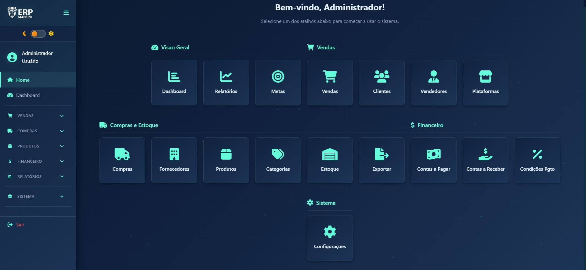

# ERP Maneiro

<div align="center">
  
</div>

Sistema ERP completo para pequenas e médias empresas, com cliente desktop para automação de postagens no Facebook Marketplace.



---

## Tecnologias

| Backend | Frontend |
|---------|----------|
| FastAPI + Uvicorn | HTML5/CSS3/JavaScript |
| MySQL 8.0+ | Chart.js |
| JWT + Bcrypt | Design Responsivo |

---

## Funcionalidades

### Módulos do ERP

| Módulo | Descrição |
|--------|-----------|
| **Dashboard** | KPIs, gráficos de vendas, produtos mais vendidos |
| **Clientes** | Cadastro PF/PJ, histórico de compras |
| **Produtos** | Cadastro, categorias, controle de estoque, até 5 imagens + 1 vídeo, miniaturas automáticas |
| **Produtos 3D** | Catálogo de peças/modelos 3D com paginação |
| **Filamentos 3D** | Controle de estoque de filamentos por cor/material |
| **Depósitos** | Cadastro de locais de estoque, com depósito padrão e coluna de localização no estoque |
| **Vendas** | Pedidos, múltiplos itens, formas de pagamento, comissões |
| **Compras** | Pedidos para fornecedores, aprovação, recebimento |
| **Estoque** | Movimentações, alertas de estoque mínimo, download de imagens/vídeo do produto |
| **Financeiro** | Contas a pagar/receber, caixa, fluxo financeiro |
| **Controle Financeiro** | Visão consolidada de entradas e saídas |
| **Propostas / Orçamentos** | Orçamentos com validade e conversão em pedidos |
| **Postagens** | Rastreio de entregas por transportadora |
| **Relatórios** | Vendas, estoque, financeiro (Excel/PDF) |
| **Metas** | Definição e acompanhamento de metas de vendedores |
| **Vendedores** | Cadastro, comissões, performance |
| **Parceiros** | Gestão de fornecedores e parceiros |
| **Calendário** | Agenda de compromissos e eventos |
| **Chat IA por Produto** | Widget flutuante para vendedores tirarem dúvidas sobre um produto com IA, com ditado por voz offline |
| **Busca OLX** | Localização e avaliação de anúncios/concorrentes na OLX |
| **Softwares** | Catálogo de softwares/downloads internos |

### Autenticação

- JWT Tokens com expiração configurável, com contador de sessão exibido no topo do sistema
- Senhas criptografadas com Bcrypt
- Níveis: Admin, Vendedor, Comprador, Financeiro
- Permissões granulares por grupo de usuário (visualizar/editar) para cada módulo, incluindo Depósitos

---

## Novidades

- **Contador de sessão**: barra no topo do sistema mostra quanto tempo falta até o usuário ser desconectado por inatividade.
- **Vídeo de produto**: além de até 5 imagens, cada produto pode ter 1 vídeo anexado, com download disponível em Estoque.
- **Depósitos**: cadastro de locais físicos de estoque, com um depósito padrão (usado quando o produto não aponta nenhum) e edição rápida via modal na tela de Estoque (restrita ao dono do produto).
- **Miniaturas automáticas**: imagens de produto geram thumbnails para carregamento mais rápido nas listagens.
- **Paginação em Produtos 3D**: listagem paginada (20 itens por página).
- **Instruções e Dúvidas + Chat IA**: campo de texto livre por produto usado como base de conhecimento para um widget de chat com IA, disponível em todas as telas, onde vendedores tiram dúvidas sobre um produto específico (com filtro "somente produto com estoque").
- **Ditado por voz offline**: transcrição de áudio local (sem depender de serviços externos) via NVIDIA Parakeet/sherpa-onnx, usada no chat de IA e nos campos de Descrição e Instruções/Dúvidas do produto.
- **Filtro "apenas com estoque"** na listagem de Produtos.
- **Limpeza de sidebar**: simplificação dos scripts de menu lateral, mantendo apenas o necessário.

---

## Cliente AutoPost Facebook

Aplicação desktop (`cliente_autopost_facebook/gui.py`) para automação de postagens no Facebook Marketplace.

### Funcionalidades

- **Login integrado** com a API do ERP
- **Seleção de produtos** por categoria (filtra ativos, com estoque e faturáveis)
- **Edição de preços** personalizados antes de postar
- **Automação Selenium** para publicar no Marketplace
- **Postagem em grupos** (até 20 grupos automaticamente)
- **Delay configurável** entre postagens (mínimo 15s)
- **Adicionar contato** na descrição automaticamente
- **Salva cookies** do Facebook para sessões futuras

### Requisitos

- Google Chrome instalado
- Dependências: `ttkbootstrap`, `selenium`, `requests`, `Pillow`, `pyperclip`

### Uso

```bash
cd cliente_autopost_facebook
python gui.py
```

1. Configure a URL da API do ERP
2. Faça login com suas credenciais
3. Selecione a categoria do Facebook (Videogames, Eletrônicos, Celulares)
4. Selecione os produtos desejados
5. Clique em "Executar" e faça login no Facebook quando solicitado

---

## Instalação com Docker (Recomendado)

### 1. Clone o repositório

```bash
git clone https://github.com/seu-usuario/ERP-Maneiro.git
cd ERP-Maneiro
```

### 2. Configure as variáveis de ambiente


```bash
cp .env.docker .env
```

### 3. Inicie os containers

```bash
docker-compose up -d --build
```

### 4. Acesse o sistema

| Serviço | URL |
|---------|-----|
| Frontend | http://localhost:3000 |
| API | http://localhost:8000 |
| Docs API | http://localhost:8000/docs |

### Credenciais padrão

| Campo | Valor |
|-------|-------|
| Email | `admin@erpmaneiro.com` |
| Senha | `admin123` |

> ⚠️ **Altere a senha após o primeiro acesso!**

### Comandos úteis

```bash
# Ver logs
docker-compose logs -f

# Parar containers
docker-compose down

# Parar e remover dados
docker-compose down -v
```

---

## Instalação Manual

### 1. Clone e instale dependências

```bash
git clone https://github.com/seu-usuario/ERP-Maneiro.git
cd ERP-Maneiro
pip install -r requirements.txt
```

### 2. Configure o ambiente

```bash
cp .env.example .env
# Edite o .env com suas credenciais do MySQL
```

### 3. Inicialize o banco de dados

```bash
python init_db.py
```

### 4. Execute

```bash
start_erp.bat
```

| Serviço | URL |
|---------|-----|
| Frontend | http://localhost:8080 |
| API | http://localhost:8000 |
| Docs API | http://localhost:8000/docs |

### Credenciais padrão

- **Email:** `admin@erpmaneiro.com`
- **Senha:** `admin123`

> ⚠️ Altere a senha após o primeiro acesso.

---

## Estrutura do Projeto

```
ERP-Maneiro/
├── backend/
│   ├── routers/          # Endpoints da API
│   ├── main.py           # App FastAPI
│   ├── auth.py           # Autenticação JWT
│   ├── database.py       # Conexão MySQL
│   └── config.py         # Configurações
├── frontend/
│   ├── css/              # Estilos
│   ├── js/               # Scripts
│   └── *.html            # Páginas
├── cliente_autopost_facebook/
│   ├── gui.py            # Interface desktop
│   └── helpers/          # Scraper Selenium
├── database/             # Scripts SQL
├── spec.md               # Especificação das features implementadas
├── .env.example          # Template de configuração
├── init_db.py            # Setup do banco
├── requirements.txt      # Dependências Python
└── start_erp.bat         # Script de inicialização
```

---

## Licença

MIT - Veja [LICENSE](LICENSE) para detalhes.
